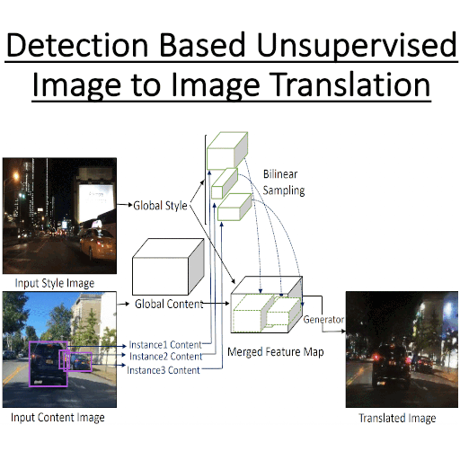

# (CVPR 2020) DUNIT: Detection-Based Unsupervised Image-to-Image Translation
Deblina Bhattacharjee, Seungryong Kim, Guillaume Vizier, Mathieu Salzmann




CVPR 2020 [Paper](https://openaccess.thecvf.com/content_CVPR_2020/html/Bhattacharjee_DUNIT_Detection-Based_Unsupervised_Image-to-Image_Translation_CVPR_2020_paper.html) 

Project Organization
------------

    ├── LICENSE
    ├── README.md          <- The top-level README for developers using this project.
    ├── data
    │   ├── external       <- Data from third party sources.
    │   ├── interim        <- Intermediate data that has been transformed.
    │   ├── processed      <- The final, canonical data sets for modeling.
    │   └── raw            <- The original, immutable data dump.
    │
    ├── docs               <- A default Sphinx project; see sphinx-doc.org for details
    │
    ├── docker             <- Dockerfiles for running the models
    │
    ├── models             <- Trained and serialized models, model predictions, or model summaries
    │
    ├── notebooks          <- Jupyter notebooks. Naming convention is a number (for ordering),
    │                         the creator's initials, and a short `-` delimited description, e.g.
    │                         `1.0-jqp-initial-data-exploration`.
   
    │
    ├── requirements.txt   <- The requirements file for reproducing the analysis environment, e.g.
    │                         generated with `pip freeze > requirements.txt`
    │
    ├── setup.py           <- makes project pip installable (pip install -e .) so src can be imported
    ├── src                <- Source code for use in this project.
    │   ├── __init__.py    <- Makes src a Python module
    │   │
    │   ├── data           <- Scripts to download or generate data
    │   │   └── make_dataset.py
    │   │
    │   ├── features       <- Scripts to turn raw data into features for modeling
    │   │   └── build_features.py
    │   │
    │   ├── models         <- Scripts to train models and then use trained models to make
    │   │   │                 predictions
    │   │   ├── predict_model.py
    │   │   └── train_model.py
    │   │
    │   └── visualization  <- Scripts to create exploratory and results oriented visualizations
    │       └── visualize.py
    │
    └── app.py             <- Interactive demonstration of the behavior of the multi-box losses


## Installation

1. Clone the repo: `git clone 
2. Install the requirements: `pip install -r requirements.txt`


### Interactive visualization of the behavior of the multi-box losses

1. Run `python app.py`
2. Open `localhost:8050` on your favorite browser.

##  Citation

If you find the code, data, or the models useful, please cite this paper:
```
     @InProceedings{Bhattacharjee_2020_CVPR,
author = {Bhattacharjee, Deblina and Kim, Seungryong and Vizier, Guillaume and Salzmann, Mathieu},
title = {DUNIT: Detection-Based Unsupervised Image-to-Image Translation},
booktitle = {Proceedings of the IEEE/CVF Conference on Computer Vision and Pattern Recognition (CVPR)},
month = {June},
year = {2020}
}
```
## License 
``` 
 [Creative Commons Attribution Non-commercial No Derivatives](http://creativecommons.org/licenses/by-nc-nd/3.0/)
```

--------

<p><small>Project based on the <a target="_blank" href="https://drivendata.github.io/cookiecutter-data-science/">cookiecutter data science project template</a>. #cookiecutterdatascience</small></p>

